# Searching Methods

## Búsqueda no informada

Como el nombre 'Búsqueda no informada' significa que la máquina sigue ciegamente el algoritmo sin considerar el costo de alcanzar la meta, la probabilidad de encontrar una solución o si la solución obtenida es correcta o incorrecta. Estos algoritmos tienen una naturaleza de fuerza bruta y no tienen información adicional sobre el espacio de búsqueda; la única información que tienen es sobre cómo atravesar o visitar los nodos en el árbol.

Por lo tanto, los algoritmos de búsqueda no informados también se denominan algoritmos de búsqueda ciega y son los conceptos básicos de los algoritmos de búsqueda en IA.

Los algoritmos de búsqueda no informada a menudo son fáciles de implementar y comprender, y los dos enfoques básicos difieren en cuanto a si verifica un objetivo cuando se genera un nodo o cuando se expande.
Algunos ejemplos de estos algoritmos son:

1. Depth First Search (DFS)
2. Breadth-First Search(BFS)
3. Uniform Cost Search(UCS) 
4. Depth Limited Search(DLS) 
5. Iterative Deepening Depth First Search(IDDFS)
6. Bidirectional Search(BS)

Todos estos ejemplos tienen diferentes complejidades de tiempo y espacio que los hacen más adecuados para diferentes problemas específicos, sin embargo, solo explicaremos los primeros dos ejemplos (DFS y BFS)

### * Algoritmos no informados vs informados.

Los algoritmos informados tienen información sobre el estado objetivo que ayuda a una búsqueda más eficiente. Esta información se obtiene mediante una función que estima qué tan cerca está un estado del estado objetivo. La búsqueda informada en IA es un tipo de algoritmo de búsqueda que utiliza información adicional para guiar el proceso de búsqueda, lo que permite una resolución de problemas más eficiente en comparación con los algoritmos de búsqueda no informados.

Esta información puede ser en forma de heurística, estimaciones de costos u otros datos relevantes para priorizar qué estados expandir y explorar.

Los algoritmos de búsqueda no informados a menudo se utilizan como punto de partida para algoritmos de búsqueda informados más complejos o como una forma de explorar el espacio de búsqueda en problemas simples. Sin embargo, en problemas complejos con grandes espacios de búsqueda, los algoritmos de búsqueda desinformados pueden ser ineficientes y conducir a un aumento exponencial en el número de estados explorados.

## Búsqueda en Profundidad (DFS) 

La búsqueda en profundidad es un algoritmo de búsqueda recursivo que sirve para recorrer y visitar todos los vértices de un grafo o árbol. De modo que, se inicia con un nodo raíz (puede ser cualquiera) y se explora cada uno de los nodos adyacentes a este buscando llegar tan lejos como sea posible a través de las ramas.  En otras palabras, se elige un nodo para comenzar, este se marca como visitado y se mueve a un nodo adyacente no visitado. Después, se repite este mismo proceso hasta que se hayan visitado todos los nodos adyacentes y en caso de que no se encuentren más se opta por el backtracking, por lo que se revisan otros nodos no visitados. 

  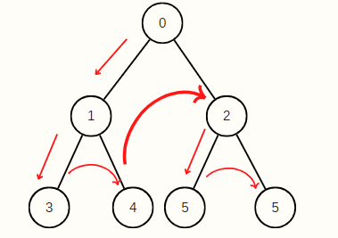

### Características 

* Cualquier implementación del algoritmo de Búsqueda en profundidad categoriza los nodos en dos estados: visitado y no visitado. 

* Este algoritmo de búsqueda tiene el propósito de recorres todos los nodos de la estructura de datos evitando los ciclos, por lo tanto, se marcan los nodos ya visitados.  

* Se emplea el backtracking debido a que cuando se están explorando los nodos adyacentes y ya no se encuentran más, este retrocede a nodos ya visitados para hallar nuevos nodos (vecinos) que no se hayan visitado.  

* Para su implementación de utiliza la estructura de datos conocido como pila. 

* Útil para la representación de problemas cuya solución se encuentre en lo más profundo del árbol/grafo. 

### Proceso para implementar la Búsqueda en Profundidad 

  

1. Declarar una pila de tamaño igual al número total de nodos del árbol o grafo. 

2. Seleccionar un nodo como punto de inicio e insertarlo a la pila. 

3. Insertar uno de los nodos no visitados (nodo adyacente al que se encuentra hasta arriba de la pila) a la pila. 

4. Repetir el paso 3 hasta que se hayan visitado todos los nodos adyacentes al nodo que este hasta arriba de la pila.  

5. Cuando no haya más nodos adyacentes, quitar el nodo de hasta arriba de la pila. 

6. Repetir el paso 3, 4 y 5 hasta que la pila no contenga ningún elemento. 

### Estrategias para implementar la Búsqueda en Profundidad 

Al recorrer todos los nodos de un grafo o árbol existen diferentes formas de hacerlo, las cuales se pueden categorizar según el orden en que se visitan los nodos o la dirección. Es por eso, que la Búsqueda en Profundidad es aplicable por medio de tres estrategias: in-orden (en medio), post-orden (después) y pre-orden (antes). 

### In-orden (en medio) 

  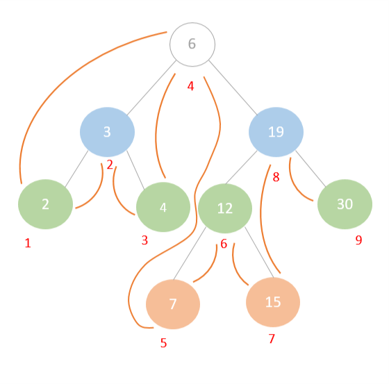

1. Se empieza por la raíz y se observa si se tiene un hijo izquierdo. En caso de que lo tenga este se continúa revisando hasta ya no encontrar nodos hijo del lado izquierdo y se marca como visitado el último.  

2. Después, cuando no haya más subárboles izquierdos se recorre el nodo raíz del último nodo recorrido. 

3. Luego, se recorre el hijo derecho y se retrocede para recorrer el subárbol derecho. 

### Post-orden (después) 

1. Se comienza por la raíz y se busca el hijo izquierdo que se encuentre a mayor profundidad para recorrerlo. (subárbol izquierdo) 

2. Luego, se recorre a sus vecinos derechos. 

3. Por último, se recorre el nodo raíz de estos. 

  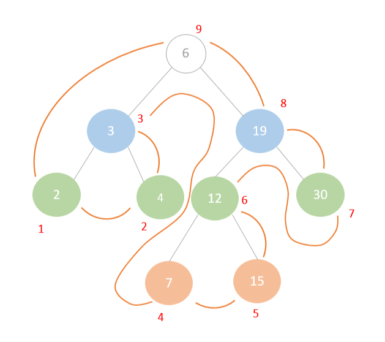

### Pre-orden (antes) 

1. En este primero se recorre el nodo raíz. 

2. Posteriormente, se recorre el hijo izquierdo y se continúa buscando hijos izquierdos a partir de este.  

3. Cuando se termina de recorrer el subárbol izquierdo, se visitan todos los hijos derechos. 

  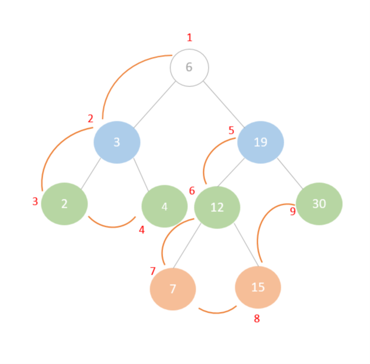

### Ejemplo de Búsqueda en Profundidad 

Para el ejemplo de búsqueda en profundidad se empleó un grafo compuesto de 5 nodos. Por lo que, primero se declara una pila de tamaño equivalente al número total de nodos de la estructura de datos. Después, se selecciona un nodo como punto de inicio, en este caso se eligió el nodo número 1. Luego, se marca como visitado el nodo 1 y este se coloca en la pila. 

  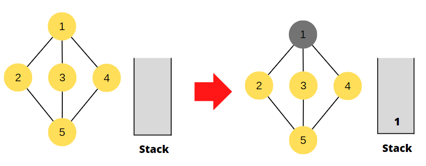

Posteriormente, se analizan los nodos adyacentes (no visitados) a este. De modo que, el nodo dos se explora y es marcado. A continuación, este es agregado a la parte superior de la pila. Seguidamente, se observan los nodos adyacentes al nodo 2, siendo el nodo 5 el único aun no visitado. Por lo cual, este es marcado como recorrido e insertado a la pila. 

  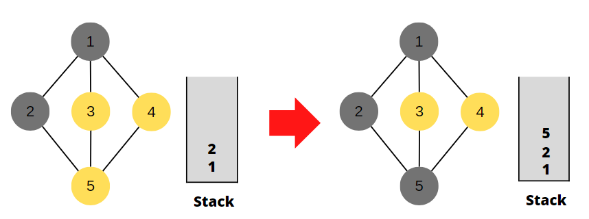

 
Más adelante, se vuelven a revisar los nodos adyacentes, pero del nodo 5. Así, que se visita el nodo 3 y este se añade a la pila. Ulteriormente, se verifican los nodos adyacentes al nodo 3, pero al haber solo nodos ya visitados se extrae el elemento que se encuentra hasta arriba de la pila. Para nuevamente consultar por nodos adyacentes al nodo 5 que aún no hubieran sido visitados.  

  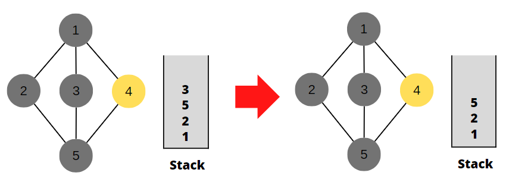

Por lo tanto, se marca el nodo 4 como visitado y es insertado en la pila. Por último, al no existir más nodos que recorrer se extrae el elemento superior de la pila que es 4.  

  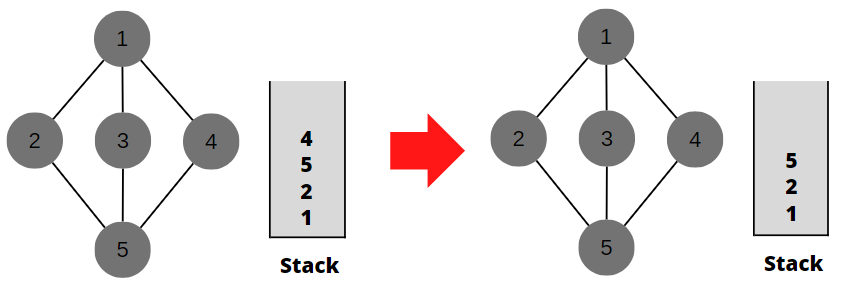

De manera que, se continúan extrayendo elementos de la pila hasta que esta esté vacía. 

  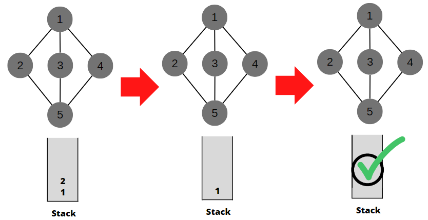

## Búsqueda en Amplitud o Anchura (BFS) 

  

Es un algoritmo con el que recorremos y/o buscamos elementos de un grafo. La búsqueda de ancho se utiliza para aquellos algoritmos donde es crítico elegir el mejor camino posible en cada momento del recorrido. Este algoritmo de grafos es muy útil en diversos problemas de programación. Por ejemplo, halla la ruta más corta cuando el peso entre todos los nodos es 1, cuando se requiere llegar con un movimiento de caballo de un punto a otro con el menor número de pasos, cuando se desea transformar algo un numero o cadena en otro realizando ciertas operaciones como suma producto, pero teniendo en cuenta que no sea muy grande el proceso de conversión, o para salir de un laberinto con el menor número de pasos, etc. Podrán aprender a identificarlos con la práctica. 

### Características 

### Proceso para implementar la Búsqueda en Profundidad 

  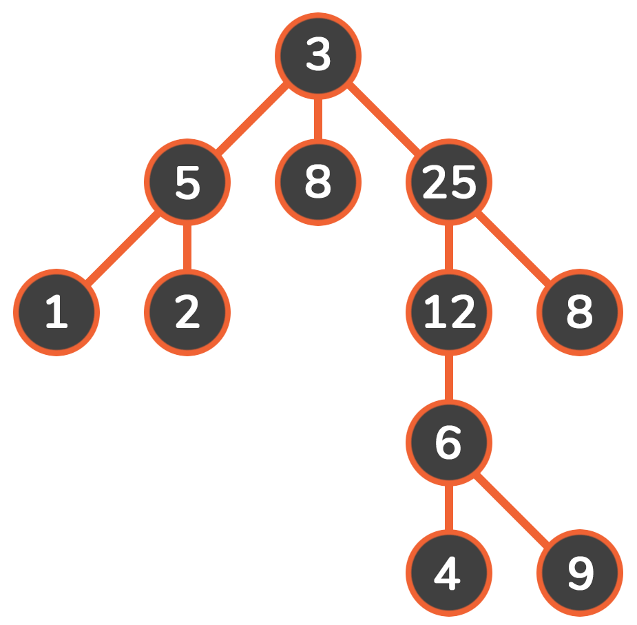

Declarar una cola de tamaño igual al número de nodos que tenemos. 

Seleccionar nuestro nodo raíz para que, a partir de este, comenzamos a recorrer nuestro grafo. 

A partir de que visitamos nuestro nodo raíz, pasamos a los nodos vecinos. Es decir, los que se encuentra a profundidad I y no I+1. 

Después de visitar al segundo nodo, pasamos al vecino de este, sin olvidar que al nodo que ya visitamos debemos expandirlo en caso de ser necesario. 

Este paso lo repetimos hasta visitar todos los nodos (en caso de ser necesario ya que como mencionamos este algoritmo busca optimizar y por lo tanto si encuentra antes el nodo objetivo, ya no es necesario que busque en los demás nodos. 

En caso de que se recorran todos los nodos y no encontremos solución, comenzaremos a extraer datos de nuestra cola empezando por el más antiguo ya que seguimos el procedimiento de FIFO 

Repetimos los pasos 3, 4 y 5 mientras la cola tenga elementos. 

### Aplicaciones del Algoritmo BFS 

Redes sociales: En las redes sociales, podemos encontrar personas dentro de una distancia dada 'k' de una persona utilizando Breadth First Search hasta niveles 'k'.   

Sistemas de navegación GPS: Breadth First Search se utiliza para encontrar todas las ubicaciones vecinas.   

Rastreadores en motores de búsqueda: Los rastreadores construyen un índice usando Breadth First. La idea es comenzar desde la página fuente y seguir todos los enlaces desde la fuente y seguir haciendo lo mismo. Depth First Traversal también se puede usar para rastreadores, pero la ventaja de Breadth First Traversal es que la profundidad o los niveles del árbol construido pueden ser limitados. 

Radiodifusión en red: En las redes o en motores de búsqueda, un paquete difundido sigue la búsqueda primero en amplitud para llegar a todos los nodos.   

Búsqueda de caminos: Podemos usar primero la amplitud o primero el recorrido transversal para encontrar si hay un camino entre dos vértices.   

Procesamiento de imágenes: BFS se puede usar para llenar una imagen con un color particular o para encontrar componentes conectados de píxeles. 

### Ejemplo Búsqueda en Amplitud o Anchura 

  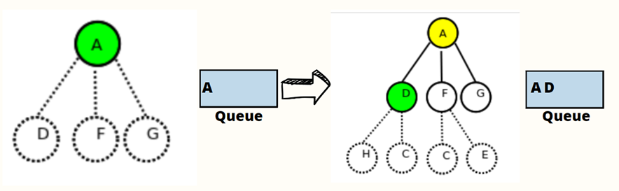

Para nuestro ejemplo ocupamos un grafo con 14 nodos, sin embargo, no fue necesario recorrer todos esto es lo más importante, em primer entra primera imagen podemos observar la creación de nuestra cola del tamaño de nuestros nodos. Comenzamos visitando nuestro nodo raíz que en este seleccionamos al de menor profundidad en este caso es A, lo visitamos y como no es el nodo que estamos buscando lo agregamos a nuestra cola, de igual forma podemos observar que expandimos los nodos vecinos de la raíz como observamos son D, F, G. 

A continuación, observamos que pasamos al nodo D, como observamos se agrega a la lista ya que de igual forma no es la solución que estamos buscando. Por otra parte, aunque podemos observar los nodos hijos de D y F, los únicos que hemos expandido son los nodos de D ya que como explique este nodo ya fue visitado. 

 

En esta segunda imagen observamos que avanzamos al nodo F, dado que nuevamente no es la solución óptima la agregamos a la cola, es importante recalcar que se ordenan de esa forma ya que siguen el principio FIFO, como podemos observar en el siguiente paso los nodos de F ya se expandieron esto como consecuencia de que ya recorrimos este nodo, pasamos a G y de la misma manera se añade a la cola al no ser la solución que buscamos , sin embargo una diferencia importante que observamos es que este nodo no tiene hijos es por esto que no observamos conexiones debajo de él. 

En esta tercera imagen observamos que avanzamos al siguiente nivel y comenzamos con los hijos del nodo más antiguo después del que es raíz, por lo tanto, son los hijos de D que en este caso son H y C, comenzamos con H y vemos que se añade a la cola esto como consecuencia de que no es aún solución, en la siguiente imagen observamos que ya se expandió H y tiene un solo hijo sin embargo esto ya no es relevante, ya que a continuación tenemos el Nodo c, que es el nodo que estamos buscando  por lo tanto ya no se expandió este nodo ni los que siguen. 

Este algoritmo reinicia el recorrido para verificar que el camino que encontró sea el óptimo, es por eso que de nueva cuenta comenzamos en A, ya que este nodo era el más antiguo que se encontraba en nuestra cola y aplicando el procedimiento FIFO, el más antiguo es el primero en salir, por esta misma razón es que el nodo que continua es B y como observamos estos dejan de estar en la cola. 

 

De igual forma en esta imagen continuamos con el mismo proceso que el anterior, al ser F el que sigue en la cola sale y continuamos con G de esta forma el algoritmo verifica que la secuencia que obtuvo en el primer recorrido sea la correcta.  

Por último, en esta imagen observamos que nuestro algoritmo termina de verificar que efectivamente tomo el camino optimo y correcto. Ya que la lista queda vacía y obtuvo el mismo recorrido y llego al nodo que estaba buscando. Otro punto importante a destacar es la confirmación de que efecto a pesar de que los nodos puedan tener hijos no es necesario recorrerlos a todos para encontrar el mejor camino.  

